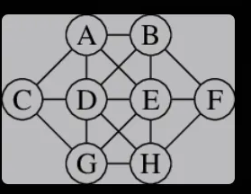

# Intro to CP and Combinatorial Optimisation
## Aims:
- introduce/remind what a combinatorial optimisation problem is
    - similarly decision problem
- mention types of solvers
- introduce idea of a CP
- start modelling with MiniZinc

## Resources:

Other people's intros:
- https://www.cs.upc.edu/~erodri/webpage/cps/theory/cp/intro/slides.pdf
- https://ktiml.mff.cuni.cz/~bartak/constraints/intro.html
- Peter Stuckey's course: https://www.coursera.org/lecture/basic-modeling/1-1-1-first-steps-PYg0S (and the stuff after that)

# Notes:
## What do we mean by combinatorial optimisation?
- we're looking at discrete problems here - no real numbers
- you've seen lots of these before in CS, and we'll look at some examples
- optimisation finds a solution that optimises some characteristic
    - e.g. the biggest clique, the fastest schedule, etc.
- decision asks if it can be done (e.g. can we colour a graph with three colours)
    - decision versions are important from a complexity perspective: recall NP-completeness notions 

### Example problem: Max Clique
- given a graph $G = V, E$ and an integer $k$: is there a clique of at least size $k$ in $G$?
    - a clique is a set of vertices that are all pariwise adjacent
- or, in the optimisation version: what is the size of the largest clique?
- (planned live example)

### Example problem: Graph 3-colouring
- given a graph $G = (V, E)$ can we assign colours to the vertices of the graph so that no two adjacent vertices have the same colour?
- (planned live example)

### Example problem: Satisfiability (particularly 3-CNF SAT)
- this one is a bit special from a complexity perspective
- 3-CNF-SAT is conjunctive normal form satisfiability in which all clauses have three literals
- Given a formula $F$ in propositional logic, is $F$ satisfiable?
    - is there a truth value assignment to the variables mentioned in $F$ such that $F$ is overall True?
- (planned live example)


## Example solver types:
There are many types of general solver for these types of problems, and often these go along with expressing the problem in particular ways.  We'll touch on some of these throughout the course, and I'll mention a few now:
- CP solvers based on search
- SAT solvers
- IP solvers
- SIMPLEX
- Not-guaranteed-to-be-optimal heuristic solvers

### Example solver approach: (Exhaustive) Combinatorial search
To get started with search-based spproaches, let's talk about a naive approach to combinatorial search
- we'll do it via an example of max clique
- we'll draw a search tree
- (planned live example)

## But isn't this course about constraint programming?
Ok, fine.  Enough solving for now, let's talk CP.  

A \emph{constraint program} is a framework for solving \emph{constraing satisfaction problems} (CSP).  

A CSP is a triple consisting of:
- variables
- domains for the variables
- constraints
Often we'd denote these $(X, D, C)$ where $X$ is a set of variables, $D$ is a set of domains for the variables, $C$ are constraints 

### Example: Graph colouring on graph $G = (V, E)$:
- Variables: $\{c_v |  v \in V\}$ - colour for each vertex
- Domains: $\{1, 2, ... k\}$ - all the colours
- Constraints: when $(u, v) \in E$ then $c_u \neq c_v$

(planned live example)

### Example: Satisfiability on formula $F$:
- Variables: all the variables in the formula
- Domains: \{True, False\} for all variables
- Constraints: the entire formula $F$

(planned live example)

### More formally, what are constraints?
One way to formally view a **constraint** is as a pair $C = (S, R)$ where $S = (x_{i_1}, ... x_{i_k})$ are the variables the constraint is about (the scope), and $R$ are the tuples that satisfy the constraint - note that therefore 
$R \subseteq d_{i_1} \times ... \times d_{i_k}$ where $d_{i_j}$ is the domain of $x_{i_j}$.  

But for many kinds of constraints this would be an unacceptably cumbersome set, and so we often specify constraints in more compact ways, e.g. those above for colouring, SAT. 

### Before we continue, a note about solution concepts
We are sometimes interested in different notions of *solution*.  We'll touch on these as we go and have already brushed up against them, but for now note that sometimes we want:
- all solutions
- a single solution (decision?)
- the cheapest solution (optmisation?)

## MiniZinc
 MiniZinc is a modelling language for CSPs that conveniently comes with hooks into various solvers.  We are using MiniZinc so that we can get up and constraint programming as quickly as possible.  
 
We'll start working through a MiniZinc tutorial and then work on some examples:
http://www.dcs.gla.ac.uk/~pat/cpM/minizincCPM/tutorial/minizinc-tute.pdf
or here: https://www.minizinc.org/doc-2.5.5/en/modelling.html
I sometimes like to run MiniZinc from Python: https://minizinc-python.readthedocs.io/en/latest/getting_started.html


## Graph colouring with input files
Let's look at one of the graph colouring solutions we looked at last time:

```
int: n;
set of int: NODE = 1..n;
int: m;
set of int: EDGE = 1..m;
array[EDGE] of NODE: from;
array[EDGE] of NODE: to;
int: k;
set of int: COLOUR = 1..k;
array[NODE] of var COLOUR: colours;

constraint forall(e in EDGE)(colours[from[e]] != colours[to[e]]);

solve minimize max(colours)
```
We can specify the graph we're working with by being specific about the size and edges in another (.dzn) file:

```
n = 5;
m = 6;
k = 4;
from = [1, 1, 2, 3, 3, 4];
to =   [2, 4, 3, 4, 5, 5];
```

To think about: what if we don't want to minimize colours, but instead just do a decision version with an input k?  What role does k play in the original version - what if we take it out?

How is the solver looking for solutions?  

----
## Coin changer
Classic problem you've probably seen in an algorithms course, and solved using dynamic programming.  

Given a list of coin denominations and a sum, give a list of coins that make up that sum.  

- Example: you have coins in the denominations: [1, 5, 10, 20] and must make up the sum 75.
    - One possible solution: 75 pennies - probably not prefered!
    - Another probably better solution: 3x20, 1x10, 1x5

I have a canned solution prepped, but have a go at discussing or coding up, using the stub:
```
int: total;
array[1..5] of int: coins = [1, 5, 10, 20, 50];

array[1..5] of var 0..100: counts;
```

Some of you have already seen the sum operator, but if not we'll see an example here.  


To think about: What if we want to add other restrictions?


----
## Production planning

We have to make products, given a supply of commodities/materials/resources. 
Each product has a demand for these commodities/materials/resources.
We have a given supply of each commodity/material/resource.
Each product has a given value.

We have an optimization problem "Maximize the value of production" and a 
decision problem "Can you meet the production target V?"

This is a real problem. The products may be "hard/tangible" things such as 
cars, phones, food etc. They might also be "soft" such as a services. A product
might even be software! And the commodities/materials/resources might be metals,
people-hours, energy, pollutants (CO2), ...

Who cares? Who cares about production planning? At what point might an endeavour
actually start planning production?
- note a few real considerations: how accurate are our measurements? can we guarantee sensibleness?  How robust are our optimisations to uncertainties of various kinds?


In this example look at computational costs of finding and proving optimality
via the optimization model and then via a sequence of decision problems.

Do we notice anything interesting with respect to finding optimal and proving optimal?
Are all problems hard?


To MiniZinc!

----
## Crystal maze puzzle 



Put the numbers 0 to 7 in the circles so that no two adjacent circles have consecutive numbers.

Work on this for a few minutes and note *how* you try to do it. 
:penguin:
:penguin:
:penguin:
:penguin:
:penguin:
:penguin:
:penguin:
:penguin:
:penguin:
:penguin:
:penguin:
:penguin:
Any insights into how to solve?
- often people think about what are *the most constrained* places, and what are the least constraining values
- try a guess/propagate cycle - this is the start of what we'll move onto next week: *consistency*

Let's do a worked example. <live example here>

But for now, to MiniZinc!

Important insights: 
- how do I specify that two adjacent things aren't the same number?
- how do I specify that each node gets a different number?  
    - I'll not make you investigate - there's a special all-different constraint.  

We will do a not-very-general version first.

And now actually to MiniZinc!


