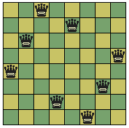
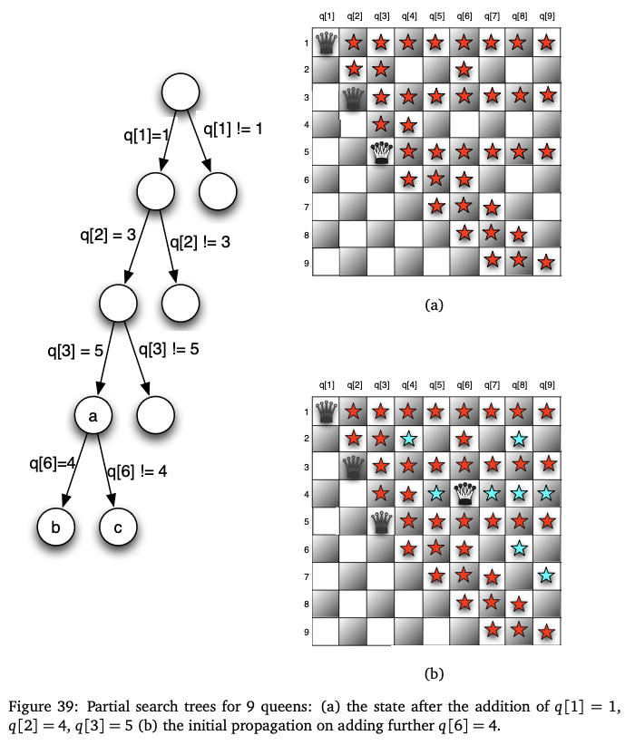
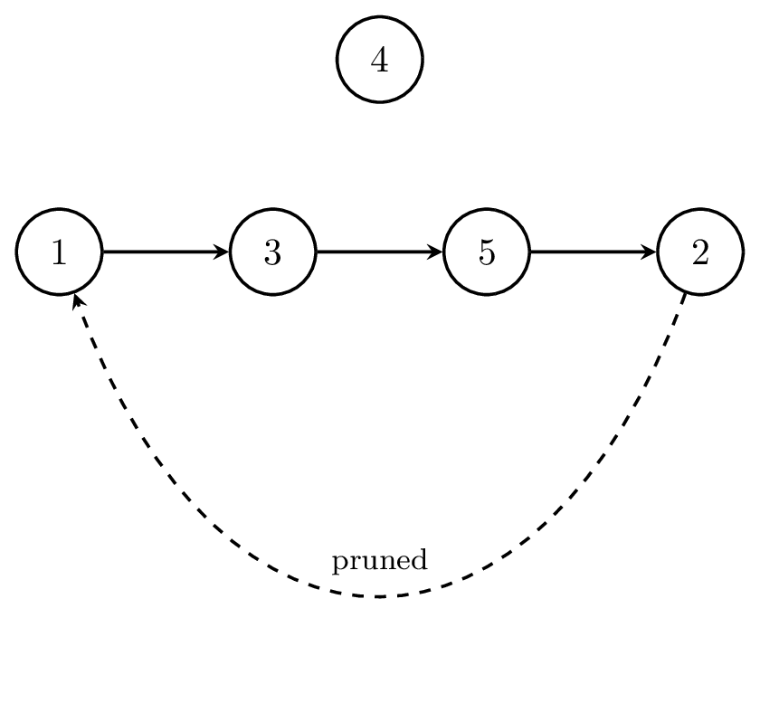
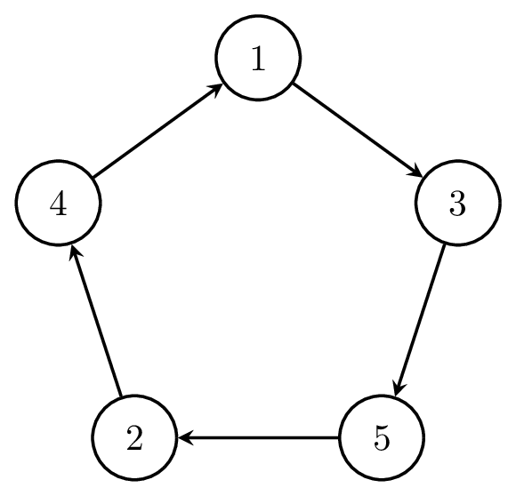

# Global constraints
We've seen at least one of these in action: all-different - now we will talk about them in a bit more.  

Global constraints allow expressing a constraint between a non-fixed number of variables.

**Global constraints** have many advantages, including that they:
- let us express constraints that occur in our models more compactly and intuitively
- may come with special algorithms to compute them more efficiently
- may allow for better inference/propagation (beyond basic arc-consistency)

The plan:
- look at all-different
    - increased expressiveness
    - matching-based algorithm 
- look at the circuit constraint
    - sub-tour elimination via a union-find-based chain rule
- (maybe) look at other global constraints via the MiniZinc catalogue and tutorial (e.g. at http://www.dcs.gla.ac.uk/~pat/cpM/minizincCPM/tutorial/minizinc-tute.pdf)
    - cardinality constraint

## All-different
Remember our requirement from assignment 1 that all arrivals must be on different days?  At least one possible solution used all-different.

n-Queens is a classic problem used to introduce all-different (and a fun problem!) so we'll discuss it.  

8-queens:

(User:Lee Daniel Crocker - modified by Fispaul at da.wikipedia, CC BY-SA 3.0 <http://creativecommons.org/licenses/by-sa/3.0/>, via Wikimedia Commons)

---
- Input: natural number $n$
- Question: Can we place $n$ queens on an $n \times n$ chessboard so that no two are in the same row, column, or diagonal?
---

Expressing this without all-different is possible but annoying.  With all-different it is straightforward in MiniZinc:

(we'll look at an example board in lecture to make sure we understand encoding)
```
int: n;
array [1..n] of var 1..n: X;
include "alldifferent.mzn";
%distinct columns
constraint alldifferent(X); 
 % distinct diagonals upwards
constraint alldifferent([ X[i] + i - 1| i in 1..n]);
 % distinct diagonals downwards
constraint alldifferent([ X[i] - i + 1| i in 1..n]);

solve satisfy;
```
Partial search tree from http://www.dcs.gla.ac.uk/~pat/cpM/minizincCPM/tutorial/minizinc-tute.pdf:  



So hopefully I've convinced you that it's convenient for encoding.  Let's talk inference (in a smaller pseudo-code example):


$x, y, z \in \mathbb{N}$
$D(x) = D(y) = \{1, 2\}$
$D(z) = \{1, 2, 3\}$
$\text{all-different}(x, y, z)$

What can we infer about $z$?
Could we get this from arc consistency if we just had $x\neq y, x \neq z, y \neq z$ as our constraints?


This sort of thing might be familiar to anyone who does sudoku puzzles, and is a powerful thing about all-different.  


## Matchings for all-different

We want to exclude domain values that are not part of any all-different value assignment.  Luckily, graph theory can help us with **maximum matchings**

Let's visualise our possible assignments as a bipartite graph (that is, a graph with two parts that only has edges between the parts).
- vertex set of one part is the variables that are all-different
- vertex set of other part is possible values
- edge from variable $v$ to value $d$ if $d$ is in $D(v)$:

(will draw out for our small example above)

A maximum matching on a bipartite graph like this is a set of edges such that:
- no two edges share an endpoint
- there are as many edges in this set as possible

If our problem is satisfiable, then there must be a matching that is as large as the set of all-different variables.  

Proof sketch where $V_1$ is set of variables, $V_2$ is set of values:
- satisfiable implies matching:  Take the satisfying assignment $\Phi: V_1 \rightarrow V_2$.  As it is satisfying, we know that $|\Phi| = |V_1|$ and $\Phi(v_i) \neq \Phi(v_j)$ for all distinct $v_i, v_j \in V_1$.  Then take the set of edges $E_M = \{(v, x)\}$ where $v \in V_1$, $x \in V_2$, and $\Phi(v) = x$.  We still need to show that:
    - $|E_M| = |V_1|$
    - $E_M$ are edges in our graph
    - for every pair of edges $(v, x)$ and $(u, z)$ in $E_M$ we have that $v \neq u$ and $x \neq z$
- Let's do the second part together in lecture.

Alright, so we're only interested in edges that are in *some* max matching, but how can we tell that?

Jack Edmonds and Claude Berge can help:


(claim due to Berge, algorithm from Edmonds)
---
- An edge belongs to some but not all maximum matchings if and only if for an arbitrary maximum matching, it belongs to either an even alternating path which begins at a free node, or an even alternating cycle.
---


OK, we've been lazy.  Some definitions:
Let $M$ be a matching. 
- edge in $M$ is a *matching edge*
- every edge not in $M$ is *free*. 
-  node is *matched* if it is incident to a matching edge and *free* otherwise.
-  *alternating path* or *cycle* is a path or cycle whose edges are alternately matching and free.

We'll draw a picture in lecture - possibly a little one and a big one. 

What complexity is this?  Note that you couldn't really work it out without specifying our alternating path algorithm - we'll just state it here to consider how fast it is compared with a full search tree.  


If we are enforcing all-different over $k$ variables, and the largest domain over those variables is size $m$, then $O(km\sqrt{k})$ to get matchings information, which dominates. 

The main thing to notice is that this is much faster than a full search, so likely saves us time.

A few resources:
- https://www.cs.upc.edu/~erodri/webpage/cps//theory/cp/global-constraints/slides.pdf
- https://www.sciencedirect.com/science/article/pii/S1574652606800106
- http://www.constraint-programming.com/people/regin/papers/globalCpaior.pdf

## Circuit constraint

We've just seen all-different, filtered to full arc consistency via maximum bipartite matching. Now consider a second global constraint, `circuit`, together with a filtering technique for it based on a union-find structure.

### Definition

Fix $n \in \mathbb{N}$ and index a set of $n$ objects (cities, tasks, locations) by $\{1,\dots,n\}$. Introduce one variable per index,
$$
\text{succ}[i] \in \{1,\dots,n\}, \qquad i = 1,\dots,n,
$$
with the intended meaning that object $i$ is followed by object $\text{succ}[i]$.

The constraint $\texttt{circuit}(\text{succ})$ holds exactly when $\text{succ}$, viewed as a function $\{1,\dots,n\}\to\{1,\dots,n\}$, is a single $n$-cycle: $\text{succ}$ is a fixed-point-free permutation of $\{1,\dots,n\}$, and iterating $\text{succ}$ from any index visits all $n$ indices before returning to it.

This is the natural model for a travelling-salesperson-style problem: assign every location a successor, then (in the optimisation version) minimise total edge cost.

### All-different is necessary but not sufficient

$\text{succ}$ must certainly be all-different: no two indices can share a successor, and no index can be its own successor. But a fixed-point-free permutation need not be a single cycle - it can decompose into several disjoint cycles.

**Example.** Take $n = 4$ and $\text{succ} = [2, 1, 4, 3]$. This is a fixed-point-free permutation, so all-different is satisfied, yet
$$
1 \to 2 \to 1 \qquad \text{and} \qquad 3 \to 4 \to 3
$$
are two disjoint $2$-cycles rather than one $4$-cycle.

![succ = [2,1,4,3]: two separate directed 2-cycles, one between nodes 1 and 2, another between nodes 3 and 4](image-4.png)

*succ = [2,1,4,3]: all-different holds, but the result is two disjoint 2-cycles, not a single circuit.*

All-different filtering therefore cannot rule out sub-tours; an additional propagation rule is required.

### Chains and a pruning rule

Suppose a subset of the $\text{succ}$ variables has been fixed. The fixed edges $(i,\text{succ}[i])$ decompose into disjoint directed paths, or *chains*; an index whose variable is not yet fixed forms a chain of length one on its own.

For an index $x$ lying on some chain, write $\text{start}(x)$ for the first index of that chain and $\text{end}(x)$ for the last, and let $\text{len}(x)$ be the number of indices on the chain. Fixing $\text{succ}[i]=j$ merges the chain ending at $i$ with the chain starting at $j$; the merged chain runs from $\text{start}(i)$ to $\text{end}(j)$, with length $\text{len}(i)+\text{len}(j)$.

**Pruning rule.** If $x$ lies on a chain with $\text{start}(x)=s$, $\text{end}(x)=e$, and $\text{len}(x) < n$, remove $s$ from $D(\text{succ}[e])$: setting $\text{succ}[e]=s$ would close a cycle of length $\text{len}(x) < n$, a sub-tour. Once $\text{len}(x)=n$, the edge $\text{succ}[e]=s$ closes the unique Hamiltonian circuit and must not be pruned.

Maintaining $\text{start}$, $\text{end}$, and $\text{len}$ under repeated merges is exactly what a **union-find** (disjoint-set) structure with path compression provides, in amortised time $O(\alpha(n))$ per operation, where $\alpha$ is the inverse Ackermann function.

This is essentially the `nocycle` propagator of Caseau and Laburthe (1997); see the resources below.

### Worked example

Take $n=5$ and fix $\text{succ}[1]=3$, then $\text{succ}[3]=5$, then $\text{succ}[5]=2$, in that order. Two filters act throughout: the pruning rule above, and all-different (an already-claimed successor value cannot be reused elsewhere).

Initially $D(\text{succ}[i]) = \{1,\dots,5\}\setminus\{i\}$ for every $i$.

- $\text{succ}[1]=3$: chain $1\to 3$, length $2$. Pruning rule removes $1$ from $D(\text{succ}[3])$, giving $D(\text{succ}[3])=\{2,4,5\}$.
- $\text{succ}[3]=5$: chain $1\to3\to5$, length $3$. Pruning rule removes $1$ from $D(\text{succ}[5])$, giving $D(\text{succ}[5])=\{2,3,4\}$.
- $\text{succ}[5]=2$: chain $1\to3\to5\to2$, length $4$. Pruning rule removes $1$ from $D(\text{succ}[2])$.



*State after fixing succ[1]=3, succ[3]=5, succ[5]=2: a single chain 1 to 3 to 5 to 2 of length 4 < 5, index 4 still unattached, and the closing edge succ[2]=1 pruned.*

At this point $D(\text{succ}[2]) = \{1,3,4,5\}\setminus\{1,3,5\} = \{4\}$: $3$ and $5$ are removed by all-different (already claimed by $1$ and $3$ respectively), and $1$ by the pruning rule. So $\text{succ}[2]=4$ is forced.

This extends the chain to $1\to3\to5\to2\to4$, length $5=n$. Now $D(\text{succ}[4]) = \{1,2,3,5\}\setminus\{2,3,5\}=\{1\}$, and since $\text{len}=n$ the pruning rule permits $\text{succ}[4]=1$.



*The completed circuit 1 to 3 to 5 to 2 to 4 to 1.*

Propagation alone determines the full circuit from three initial decisions, with no search.

### Completeness

Union-find keeps this filtering cheap: $O(n\,\alpha(n))$ overall. It is not, however, complete. Full generalised arc consistency for `circuit` would require deciding, for every remaining candidate value of every variable, whether it extends to some Hamiltonian circuit consistent with the current domains. Taking domains directly from a graph's adjacency structure reduces this decision problem to deciding Hamiltonicity of that graph, which is NP-complete (Karp, 1972). So no polynomial-time filtering algorithm achieves full consistency for `circuit` unless $P=NP$. The pruning rule above is sound but incomplete, and is used together with all-different's matching-based filter, which is complete for all-different on its own.

### Circuit in MiniZinc

```
int: n;
array[1..n] of var 1..n: succ;
include "circuit.mzn";
constraint circuit(succ);

solve satisfy;
```

The all-different filtering, chain tracking, and sub-tour pruning above all take place inside this single `circuit(succ)` call.

The optimisation version (shortest tour, i.e. classic TSP) adds costs and an objective:

```
int: n;
array[1..n, 1..n] of int: cost;
array[1..n] of var 1..n: succ;
include "circuit.mzn";
constraint circuit(succ);

solve minimize sum(i in 1..n)(cost[i, succ[i]]);
```

A few resources:
- Y. Caseau and F. Laburthe, "Solving Small TSPs with Constraints," *Proc. 14th International Conference on Logic Programming (ICLP)*, MIT Press, 1997, pp. 316-330. Available at https://www.dcs.gla.ac.uk/~pat/cpM/papers/caseau97solving.pdf
- R. M. Karp, "Reducibility Among Combinatorial Problems," in *Complexity of Computer Computations*, Plenum Press, 1972, pp. 85-103.
- https://www.minizinc.org/doc-2.3.0/en/lib-globals.html (see `circuit`)

## Global cardinality constraint

This is a generalisation of the all-different constraint: 
- set of variables $X$ take their values from domain $D$, and constrains the number of times that any value can be assigned to variables within some range.  

Example: remember rota scheduling? we might have some minimum and maximum possible number of people working each night/day shift.  Of course we can do this without a global constraint, but it makes it easier (and faster!) as with all-different. 

Pulling a code snippet out for the guards rota example:
(full examples and problem description at: https://github.com/magicicada/cp/tree/main/week_by_week/week_3/afternoon_examples/guard_rota)

Without global cardinality:
```
% the number of guards that must be on duty in each shift of each day
array[DAYS] of var lwbDay .. upbDay: totalOnDay;
constraint forall(d in DAYS)(totalOnDay[d] = sum(g in GUARDS)(roster[g,d] = DAY));
array[DAYS] of var lwbNight .. upbNight: totalOnNight;
constraint forall(d in DAYS)(totalOnNight[d] = sum(g in GUARDS)(roster[g,d] = NGT));
```

With:
```
% the number of guards that must be on duty in each shift of each day
array[DAYS] of var lwbDay..upbDay: totalOnDay;
array[DAYS] of var lwbNight..upbNight: totalOnNight;
constraint forall(d in DAYS)(global_cardinality([roster[g,d] | g in GUARDS],[DAY,NGT],[totalOnDay[d],totalOnNight[d]]));
```

## Summary
As a general message: these special global constraints are expressive, and typically faster than rolling your own.  Some, like all-different, admit filtering that is both cheap and complete; others, like circuit, only admit filtering that is cheap but incomplete (full consistency for circuit is NP-hard) - still very much worth having, just not the whole story on their own.

Try to use them when you can!

https://www.minizinc.org/doc-2.3.0/en/lib-globals.html
