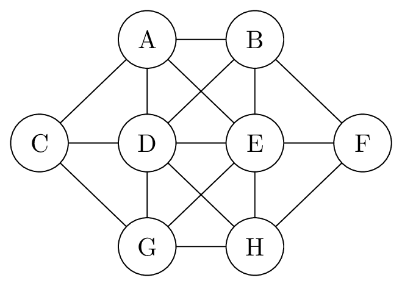

# Introduction to Constraint Programming and Combinatorial Optimisation

## Learning aims

By the end of this session, students should be able to:
- distinguish between decision and optimisation problems;
- recognise several common families of combinatorial problems and solver technologies;
- describe a constraint satisfaction problem in terms of variables, domains, and constraints; and
- begin modelling problems in MiniZinc.

## Combinatorial problems

In this course we focus on *discrete* problems: the choices are drawn from finite and countable sets rather than from a continuous range of real values.[^relaxation] Many familiar computer-science problems have this form, including graph colouring, satisfiability, scheduling, and routing.

[^relaxation]: Mostly! We do look briefly at linear relaxations, which involve the real numbers.

An *optimisation problem* asks for a feasible solution that is best according to some objective. Examples include finding the largest clique in a graph, producing the shortest schedule, or maximising the value of a production plan. A corresponding *decision problem* asks whether a solution meeting a specified threshold exists. Decision versions are particularly important in complexity theory and in the study of NP-completeness.

In lecture we will look briefly at three example problems: maximum clique, graph colouring, and boolean satisfiability.

### Example: the clique problem

Let $G=(V,E)$ be a finite simple undirected graph (all of my graphs are, unless I tell you otherwise). A subset $S\subseteq V$ is a *clique* if every pair of distinct vertices in $S$ is joined by an edge; that is,
$$
\forall u,v\in S,\quad u\neq v \Longrightarrow \{u,v\}\in E.
$$

The *decision version* of the clique problem is defined as follows:

- **Instance:** an undirected graph $G=(V,E)$ and an integer $k$ with $1\leq k\leq |V|$;
- **Question:** does there exist a set $S\subseteq V$ such that $|S|\geq k$ and $S$ is a clique in $G$?

The output is therefore either *yes* or *no*. This decision problem is commonly denoted by **Clique**.

The corresponding *optimisation problem*, **Maximum Clique**, is:

- **Instance:** an undirected graph $G=(V,E)$;
- **Feasible solutions:** all subsets $S\subseteq V$ that form cliques in $G$;
- **Objective:** maximise $|S|$.

The optimal objective value is the *clique number* of $G$, denoted
$$
\omega(G)=\max\{\,|S|:S\subseteq V \text{ and } S \text{ is a clique}\,\}.
$$

In lecture we will draw an example on the visualiser.

### Example: the graph-colouring problem

Let $G=(V,E)$ be a finite simple undirected graph and let $k$ be a positive integer. A *proper $k$-colouring* of $G$ is a function
$$
c:V\longrightarrow \{1,\ldots,k\}
$$
such that adjacent vertices receive different colours:
$$
\forall\{u,v\}\in E,\quad c(u)\neq c(v).
$$

The *decision version* of the graph-colouring problem is:

- **Instance:** an undirected graph $G=(V,E)$ and a positive integer $k$;
- **Question:** does there exist a proper $k$-colouring of $G$?

This problem is denoted by **$k$-Colourability** when $k$ is fixed. In particular, **3-Colourability** asks whether the vertices of $G$ can be properly coloured using at most three colours.

The corresponding *optimisation problem*, **Minimum Graph Colouring**, is:

- **Instance:** an undirected graph $G=(V,E)$;
- **Feasible solutions:** all proper colourings of $G$;
- **Objective:** minimise the number of colours used.

The optimal objective value is the *chromatic number* of $G$, denoted
$$
\chi(G)=\min\{\,k:G\text{ has a proper }k\text{-colouring}\,\}.
$$

In lecture we will draw an example on the visualiser.

### Example: the satisfiability problem

Let $F$ be a propositional formula over a finite set of Boolean variables $X=\{x_1,\ldots,x_n\}$. A *truth assignment* is a function
$$
\alpha:X\longrightarrow\{\mathit{false},\mathit{true}\}.
$$
The assignment $\alpha$ *satisfies* $F$ if evaluating $F$ under $\alpha$ produces the value $\mathit{true}$.

The *decision problem* **SAT** is:

- **Instance:** a propositional formula $F$;
- **Question:** does there exist a truth assignment $\alpha$ that satisfies $F$?

If $F$ is in conjunctive normal form and every clause contains exactly three literals, the restricted problem is called **3-SAT**.

A natural optimisation variant is **Max-SAT**. Let $F=C_1\land\cdots\land C_m$ be a formula in conjunctive normal form. Then:

- **Instance:** the clauses $C_1,\ldots,C_m$ over a set of Boolean variables;
- **Feasible solutions:** all truth assignments to those variables;
- **Objective:** maximise the number of clauses satisfied by the assignment.

Writing $[C_i(\alpha)]$ for $1$ when $\alpha$ satisfies $C_i$ and $0$ otherwise, the optimal value is
$$
\operatorname{MaxSAT}(F)=\max_{\alpha}\sum_{i=1}^{m}[C_i(\alpha)].
$$

You will have seen examples of this in algorithmics courses because of the important role that SAT plays in complexity theory, but here is another:

Consider the following formula over the variables $x_1,x_2,x_3$:
$$
\begin{aligned}
F={}&(x_1\lor\neg x_2\lor x_3)
\land(\neg x_1\lor x_2\lor x_3)\\
&\land(x_1\lor x_2\lor\neg x_3)
\land(\neg x_1\lor\neg x_2\lor x_3).
\end{aligned}
$$
This is a $3$-CNF formula because it is a conjunction of clauses, each containing exactly three literals.

The assignment
$$
\alpha(x_1)=\mathit{true},\qquad
\alpha(x_2)=\mathit{false},\qquad
\alpha(x_3)=\mathit{true}
$$
satisfies $F$. Substituting these values into the clauses gives
$$
\begin{aligned}
    C_1&=(\mathit{true}\lor\mathit{true}\lor\mathit{true}),\\
    C_2&=(\mathit{false}\lor\mathit{false}\lor\mathit{true}),\\
    C_3&=(\mathit{true}\lor\mathit{false}\lor\mathit{false}),\\
    C_4&=(\mathit{false}\lor\mathit{true}\lor\mathit{true}).
\end{aligned}
$$
Every clause evaluates to $\mathit{true}$, so $F$ is a *yes-instance* of **3-SAT**, with $\alpha$ as a satisfying assignment.

## Solver technologies

There are many general-purpose approaches to discrete decision and optimisation problems. The model used to express a problem is often closely connected to the solver technology. During the course we will encounter several approaches:
- constraint-programming solvers based on propagation and search;
- Boolean satisfiability (SAT) solvers;
- integer-programming (IP) and mixed-integer-programming solvers;
- linear-programming methods, including the simplex algorithm; and
- heuristic and metaheuristic methods, which may find good solutions without proving optimality.

We will focus on CP solvers, and spend some time on SAT and IP solvers, and only briefly discuss the others. We start with a discussion of a basic exhaustive search, and then move to backtracking search - the basis for most of these approaches.

### A first approach: exhaustive search

A first possible approach to a decision problem is to list every possibility and check if it is a solution: for example, if we are looking for a clique of size 5, we could check every set of five vertices. For SAT we could check every truth assignment to see if any of them satisfy our expression. This is obviously infeasible in general.

One step further is tree-based enumeration, where we construct a tree describing a search through solution space. For the maximum-clique problem, for example, we could construct a search tree in which each level decides whether a particular vertex belongs to the candidate clique. This gives a correct algorithm, but the number of candidates still grows exponentially. Modern solvers improve on naive enumeration by pruning choices that cannot lead to feasible solutions, as well as using various techniques to choose which branches to expand first.

Live in lecture we will draw part of a search tree for a small colouring instance, showing where we can prune infeasible branches.

Tree search will be the basis of most solving approaches that we look at in this course.

## Constraint programming

Now we change tack to discuss constraint programming: a particular way of modelling and solving combinatorial problems.

Constraint programming (CP) is a framework for modelling and solving *constraint satisfaction problems* (CSPs). A CSP is commonly represented as a triple
$$
(X,D,C),
$$
where:
- $X=\{x_1,\ldots,x_n\}$ is a set of variables;
- $D=\{D_1,\ldots,D_n\}$ gives a domain $D_i$ of possible values for each variable $x_i$; and
- $C$ is a set of constraints restricting which combinations of values may be assigned to the variables.

A solution is a complete assignment of values to variables, with $x_i\in D_i$ for every $i$, that satisfies every constraint in $C$.

### A CSP model for graph colouring

For a graph $G=(V,E)$ and a set of $k$ available colours, define:
- **Variables:** one variable $c_v$ for every vertex $v\in V$;
- **Domains:** $c_v\in\{1,\ldots,k\}$ for every $v\in V$;
- **Constraints:** $c_u\neq c_v$ for every edge $(u,v)\in E$.

This model separates the description of the problem from the method used to solve it. The same model may be handled by different CP solvers, each with its own propagation and search strategies.

### A CSP view of satisfiability

For a propositional formula $F$:
- **Variables:** the propositional variables occurring in $F$;
- **Domains:** $\{\mathit{false},\mathit{true}\}$ for every variable;
- **Constraints:** the clauses, or equivalently the requirement that $F$ evaluates to true.

### Constraints as relations

More formally, a constraint may be represented as a pair $(S,R)$. Its *scope*
$$
S=(x_{i_1},\ldots,x_{i_r})
$$
is the tuple of variables involved, while its relation $R$ contains exactly the allowed tuples of values. Therefore,
$$
R\subseteq D_{i_1}\times\cdots\times D_{i_r}.
$$
Listing every allowed tuple is often impractical, so constraints are usually written more compactly - for example, $c_u\neq c_v$, a linear inequality, or a global constraint such as `all_different`.

### What kind of solution do we need?

The required output depends on the problem. We may want:
- every solution;
- any one feasible solution;
- the number of solutions; or
- an optimal solution according to a stated objective.

It is important to decide which of these is required before choosing a model and a search strategy.

## Getting started with MiniZinc

MiniZinc is a high-level modelling language for constraint satisfaction and optimisation. A MiniZinc model describes the variables, domains, constraints, and objective independently of a particular backend solver. This makes it a useful language for experimenting with different modelling choices and solver technologies.

We will use the [MiniZinc Handbook](https://docs.minizinc.dev/en/stable/index.html) and start working through some exercises.

### Graph colouring with a data file

The following model describes a graph using arrays of edge endpoints. The number of vertices, edges, and available colours can be supplied separately in a `.dzn` data file.

```
int: n;
set of int: NODE = 1..n;

int: m;
set of int: EDGE = 1..m;
array[EDGE] of NODE: from;
array[EDGE] of NODE: to;

int: k;
set of int: COLOUR = 1..k;
array[NODE] of var COLOUR: colour;

constraint forall(e in EDGE)(
    colour[from[e]] != colour[to[e]]
);

solve minimize max(colour);
```

One possible data file is:

```
n = 5;
m = 6;
k = 4;
from = [1, 1, 2, 3, 3, 4];
to   = [2, 4, 3, 4, 5, 5];
```

**Questions for discussion.**
- How should the model change if $k$ is fixed and we only want to know whether a $k$-colouring exists?
- In the optimisation model, is $k$ an objective value, an upper bound, or both?
- What happens if the declared value of $k$ is too small?
- In what order might the solver assign colours to vertices?

### Exercise: coin change

Given a set of coin denominations and a target total, choose coin counts whose weighted sum equals the target. For example, with denominations $\{1,5,10,20\}$ and target $75$, using $75$ one-penny coins is feasible, but three $20$-pence coins, one $10$-pence coin, and one $5$-pence coin uses far fewer coins.

Start with the following declarations:

```
int: total;
array[1..5] of int: coins = [1, 5, 10, 20, 50];
array[1..5] of var 0..100: counts;
```

Add a constraint requiring the selected coins to sum to `total`. Then consider an objective that minimises the total number of coins.

**Extensions.** How would the model change if the supply of each denomination were limited, if at least one coin of each type had to be used, or if certain combinations were forbidden?

### Exercise: number-placement puzzle

Place the numbers $0$ to $7$ on the vertices of the supplied puzzle graph so that adjacent vertices never contain consecutive numbers. Before writing a model, try solving the puzzle by hand and note the reasoning strategies used.



*Figure: The Crystal Maze graph.*

Useful modelling questions include:
- How can we state that adjacent vertices do not contain consecutive values?
- How can we require every vertex to receive a different value?
- Which vertex appears most constrained, and which value is likely to constrain the remaining choices least?

The second requirement can be expressed with MiniZinc's global `all_different` constraint. A natural manual strategy is a cycle of guessing and propagation: make a tentative assignment, derive its immediate consequences, and backtrack when it leads to a contradiction. This leads us toward some of the solver techniques we will look at in the next topic.
